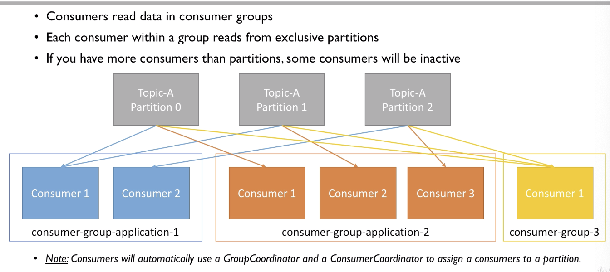

**Kafka Broker Dsicovery**

Every Kafka broker is also called a "bootstrap server".

That means that you only need to connect to one broker, and you will be connected to the entire cluster.

Each broker knows about all brokers, topics and partitions (metadata).

Every Kafka broker is also called a "bootstrap server", that means that you only need to connect to one broker, and you will be connected to the entire cluster.

**Each partition can only have 1 leader, and multiple replicas**

**Very important: you only need to connect to one broker (any broker) and just provide the topic name you want to write to. Kafka Clients will route your data to the appropriate brokers and partitions for you!**

Very important: you only need to connect to one broker (any broker) and just provide the topic name you want to read from. Kafka will route your calls to the appropriate brokers and partitions for you!


How to start the kafka server

`dataDir=/your/path/to/data/zookeeper`

`log.dirs=/your/path/to/data/kafka`

step1 start zookeeper

```shell
./bin/zookeeper-server-start.sh config/zookeeper.properties
```

step2 start the kakfa server

```
kafka-server-start.sh config/server.properties
```


### Find out list of topics on the server

```shell
kafka-topics.sh --zookeeper 127.0.0.1:2181 --list
```

### Find out the partitions of topics

```shell
kafka-topics.sh --zookeeper 127.0.0.1:2181 --topic first_topic --describe
```

output

```
Topic:first_topic	PartitionCount:3	ReplicationFactor:1	Configs:
	Topic: first_topic	Partition: 0	Leader: 0	Replicas: 0	Isr: 0
	Topic: first_topic	Partition: 1	Leader: 0	Replicas: 0	Isr: 0
	Topic: first_topic	Partition: 2	Leader: 0	Replicas: 0	Isr: 0
```

each leader has a partition.

### Setup the properties

```shell
kafka-console-producer --borker-list 127.0.0.1:9092 --topic first_topic --producer-property acks=all
```

### Consumer Property 

you specify the boostrap-server and the topic and then you can read from the begining.

```shell
kafka-console-consumer.sh --bootstrap-server 127.0.0.1:9092 --topic first_topic --from-beginning
```

### Create a consumer group

```shell
kafka-console-consumer.sh --bootstrap-server 127.0.0.1:9092 --topic first_topic --group my-first-application
```

Partitions get reassigned based on the change of the the number of consumer.

### Reset offset of consumer group

```shell
kafka-consumer-groups.sh --bootstrap-server localhost:9092 --group my-first-application --reset-offsets --to-earliest --execute --topic first_topic
```

other types of shifting

```shell
kafka-consumer-groups.sh --boostrap-server localhost:9092 --group my-first-application --reset-offsets --shift-by -2 --execute --topic first_topic
```

### Key-value pairs in Kafka

```shell
## Producer with keys
kafka-console-producer --broker-list 127.0.0.1:9092 --topic first_topic --property parse.key=true --property key.separator=,
> key,value
> another key,another value

## Consumer with keys
kafka-console-consumer --bootstrap-server 127.0.0.1:9092 --topic first_topic --from-beginning --property print.key=true --property key.separator=,
```

kafka-console-consumer uses a random group id
